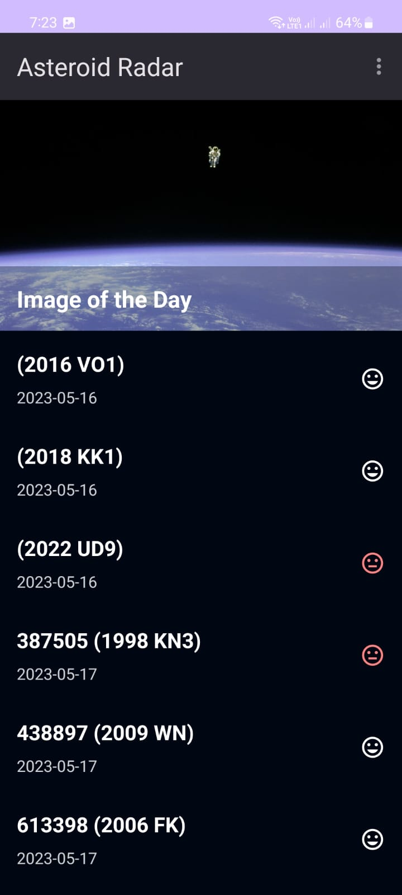

# Asteroid Radar

This repository contains the project files for the Asteroid Radar app, which was created as part of the Advanced Android Development with Kotlin course offered by Udacity.

<div style="display: flex;">
 
 
 
 
</div>

## Overview

The Asteroid Radar app is a project that retrieves a list of asteroids from the NASA NeoWs API, displays them in a RecyclerView, and allows the user to select an asteroid to see more details about it. The app also allows the user to save asteroids to a local database, and displays a list of saved asteroids on a separate screen.

## Features

The Asteroid Radar app includes the following features:

- Fetches data from the NASA NeoWs API using Retrofit.
- Displays a list of asteroids in a RecyclerView, along with their names, distances, and dates of closest approach to Earth.
- Displays image from NASA server
- Allows the user to filter the list of asteroids by date.
- Allows the user to select an asteroid to see more details about it, including its name, distance, velocity, and whether or not it is potentially hazardous.
- Caches all the data to local Room Database to access it while offline.
- Loading and Error indicators if there's no data cached.
- Updates cache even if the application is not running.
- Error Message if there's no cached data or internet connection.

## Technologies Used

The Asteroid Radar app uses the following technologies:

- Kotlin
- MVVM architecture
- LiveData
- Room
- Retrofit
- Picasso
- RecyclerView
- Data Binding
- Repository Pattern
- WorkManager

## Getting Started

To get started with the Asteroid Radar app, clone this repository to your local machine and open it in Android Studio. You will need to obtain an API key from [NASA's NeoWs API](https://api.nasa.gov/) in order to retrieve asteroid data. Once you have obtained an API key, create a file called `Constants.kt` in the `java/utils` directory, and update the `API_KEY` Constant with your own API Key:

```Kotlin

 const val API_KEY = "YOUR_API_KEY_HERE"
 
```

## Contributing

If you'd like to contribute to the Asteroid Radar app, please fork this repository and submit a pull request. I welcome contributions from all developers!
